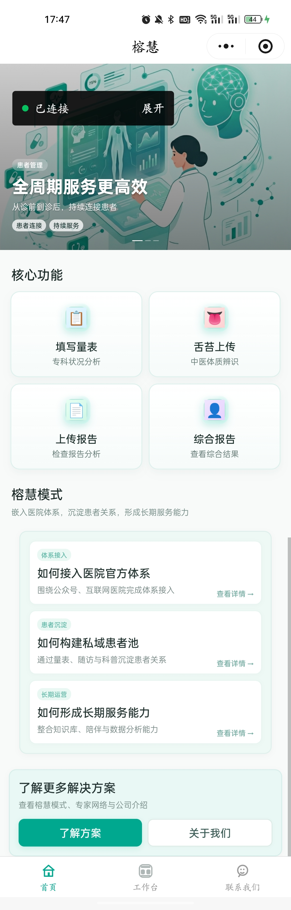
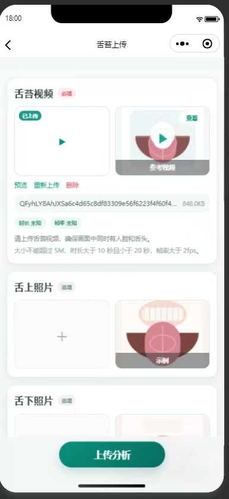
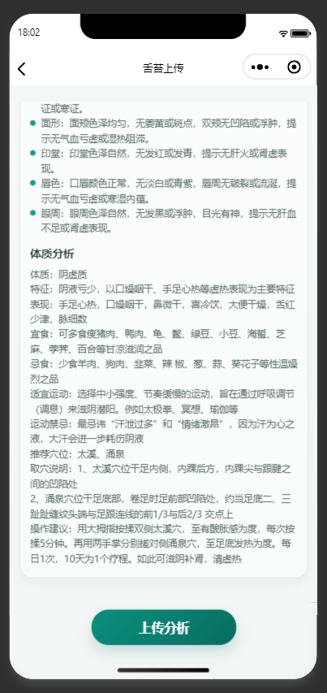
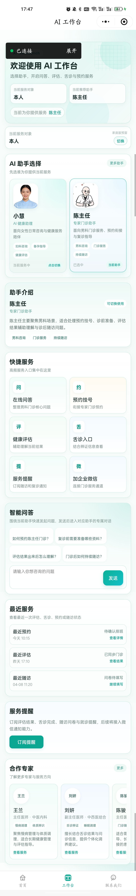
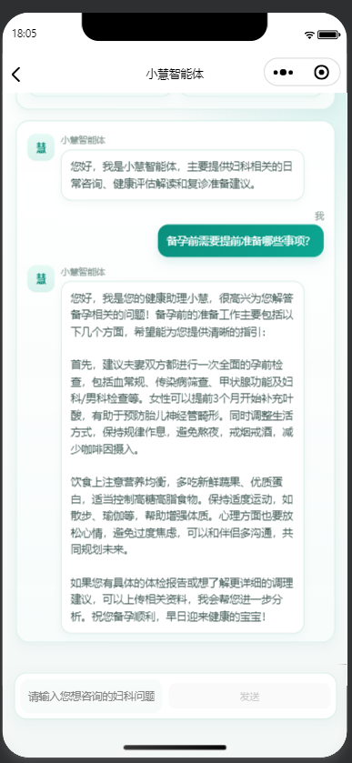
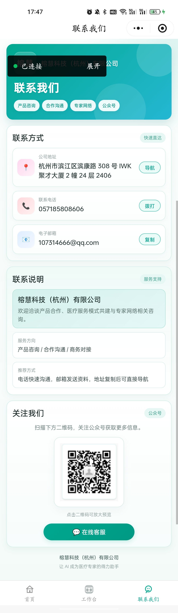

# 榕慧小程序项目

## 项目简介

榕慧小程序是一个医疗健康类微信小程序，提供智能舌诊分析和妇科智能体咨询服务。

## 项目结构

```
huiliao/
├── huiliaoMiniProgram/          # 小程序前端
│   ├── miniprogram/
│   │   ├── pages/               # 页面
│   │   ├── assets/              # 资源文件
│   │   ├── utils/               # 工具函数
│   │   └── ...
│   ├── README.md
│   └── CHANGELOG.md
├── huiliaoMiniPY/               # 后端服务
│   ├── tongue_upload_server.py  # 舌诊上传服务
│   ├── chat_proxy_server.py     # 智能体服务
│   ├── config.json              # 配置文件
│   └── README.md
└── 小程序页面展示图片/           # 页面截图
    ├── 首页.jpg
    ├── 舌苔上传功能.jpg
    ├── 舌苔分析结果展示.png
    ├── AI工作台.jpg
    ├── 小慧智能体对话展示.png
    └── 联系我们.jpg
```

## 主要功能

### 舌诊上传分析
- 上传舌苔视频进行分析
- 支持选填舌上、舌下、面部照片
- 实时显示分析结果
- 结构化展示舌象、面诊、体质分析

### 智能体咨询
- 陈主任智能体
- 小慧智能体
- 实时对话交流
- 妇科专业咨询

### 其他功能
- 首页
- 工作台
- 专家页面
- 报告上传
- 联系我们

## 后端服务

- **舌诊上传服务**：`http://127.0.0.1:8020`
- **智能体服务**：`http://127.0.0.1:8010`

## 快速开始

### 环境要求

- Python 3.8+
- 微信开发者工具
- requests 库
- aiohttp 库

### 启动后端服务

```bash
# 进入后端目录
cd huiliaoMiniPY

# 安装依赖
pip install -r requirements.txt

# 启动舌诊上传服务（新终端）
python tongue_upload_server.py

# 启动智能体服务（新终端）
python chat_proxy_server.py
```

### 启动小程序前端

1. 使用微信开发者工具打开 `huiliaoMiniProgram` 目录
2. 在「详情」→「本地设置」中勾选「不校验合法域名」
3. 点击「编译」按钮

## 配置说明

### 后端配置

编辑 `huiliaoMiniPY/config.json` 文件：

```json
{
  "life_emergence": {
    "ak": "your_api_key",
    "sk": "your_secret_key",
    "base_url": "https://open.lifeemergence.com"
  },
  "fastgpt": {
    "base_url": "http://192.168.1.208:3000/api",
    "api_key": "your_fastgpt_api_key"
  },
  "server": {
    "host": "127.0.0.1",
    "port": 8020
  }
}
```

## 页面展示

### 首页


### 舌苔上传功能


### 舌苔分析结果展示


### AI工作台


### 小慧智能体对话展示


### 联系我们


## 版本历史

详见 [CHANGELOG.md](./huiliaoMiniProgram/CHANGELOG.md)

## 技术栈

### 前端
- 微信小程序框架
- TypeScript
- SCSS

### 后端
- Python 3.8+
- requests 库
- 内置 http.server 模块

## 注意事项

### 视频要求
- 大小不超过 5MB
- 时长 10-20 秒
- 帧率大于 2fps
- 画面中需要有人脸和舌头

### 开发模式
- 本地开发时使用 HTTP 地址
- 生产环境需要配置 HTTPS 域名

### 权限设置
- 需要相机、相册权限
- 需要网络访问权限

## 联系方式

- 公司名称：榕慧科技(杭州)有限公司
- 项目地址：https://github.com/YiHarvest/huiliaoMinProgram
- 贡献者：易秋月

## 许可证

© 2026 榕慧科技(杭州)有限公司. All rights reserved.
