# 慧疗微信小程序项目

## 项目简介

慧疗小程序是一个中医健康管理微信小程序，提供智能舌诊分析、量表评估、AI健康咨询、综合报告生成等全方位健康管理服务。

## 项目结构

```
huiliao/
├── huiliaoMiniProgram/          # 小程序前端
│   └── miniprogram/
│       ├── pages/               # 29个页面
│       │   ├── home/            # 首页
│       │   ├── questionnaire/   # 量表填写
│       │   ├── tongue-upload/   # 舌诊上传
│       │   ├── scale-form/      # 量表表单
│       │   ├── scale-result/    # 量表结果
│       │   ├── chat/detail/     # AI智能助手
│       │   ├── report-upload/   # 报告上传
│       │   ├── personal-data/   # 个人中心
│       │   ├── comprehensive-report/  # 综合报告
│       │   └── ...
│       ├── utils/               # 工具函数
│       ├── assets/              # 资源文件
│       ├── app.ts               # 全局逻辑
│       └── app.json             # 配置
│
├── huiliaoMiniPY/               # Python后端服务
│   ├── chat_proxy_server.py     # 主服务（HTTP Server, 端口8020）
│   ├── mysql_storage.py         # 数据库操作
│   ├── config.py                # 配置加载模块
│   ├── config.json              # 配置文件（含敏感信息）
│   ├── wechat_subscription.py   # 微信SDK
│   └── modules/                 # 业务模块
│
│
└── 小程序页面展示图片/           # 页面截图
```

## 核心功能

### 📋 量表评估系统
- 支持 PHQ-9、GAD-7 等多种专业健康量表
- AI 智能分析量表结果，生成个性化报告
- 量表记录历史查询与追踪

### 👅 智能舌诊分析
- 上传舌苔照片进行 AI 分析
- 中医体质辨识与健康建议
- 舌象记录与对比功能

### 🤖 AI 智能助手
- 基于 FastGPT 的智能对话系统
- 专业中医健康咨询
- 对话历史记录与管理

### 📊 综合健康报告
- 整合量表、舌诊、检查报告多源数据
- AI 生成全面健康画像
- 个性化调理与治疗方案

### 📁 检查报告管理
- 支持图片/PDF 格式上传
- 报告归档与查看
- 医学指标识别与分析

### 🎁 积分商城
- 每日签到获取积分
- 积分兑换健康好礼
- 抽奖活动参与

### 🔔 订阅消息推送
- 量表完成通知
- 舌诊结果通知
- 复诊提醒服务

## 页面展示

### 首页 - 核心功能入口
<p align="center">
  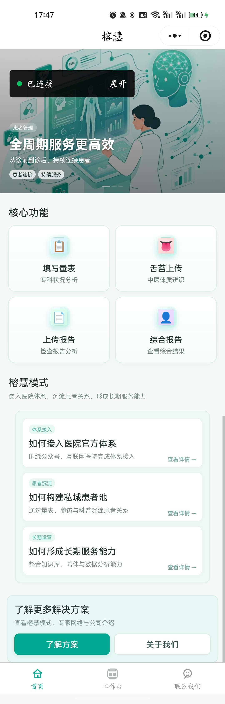
</p>

#### 四大核心功能
| 📋 填写量表 | 👅 舌苔上传 |
|:---:|:---:|
| 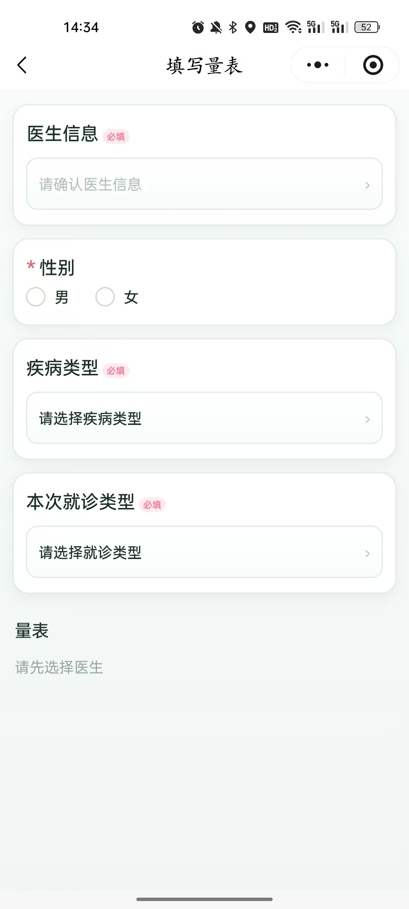 | 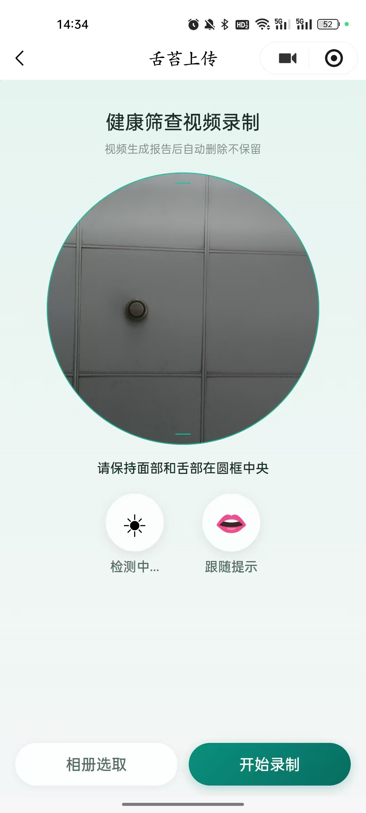 |

| � 上传报告 | 🎁 积分商城 |
|:---:|:---:|
| 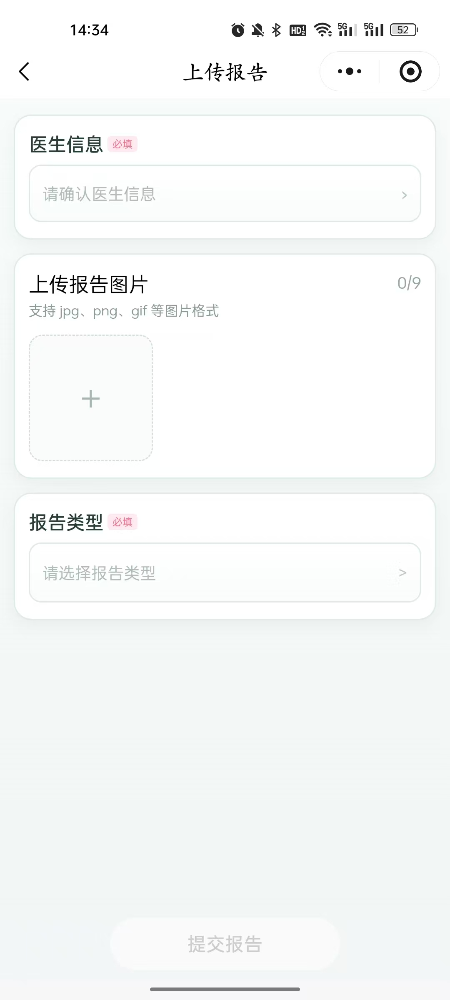 | 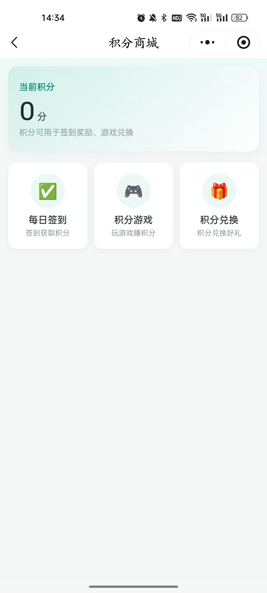 |

### AI 智能助手
| 💬 AI对话界面 | 📜 历史对话记录 |
|:---:|:---:|
| 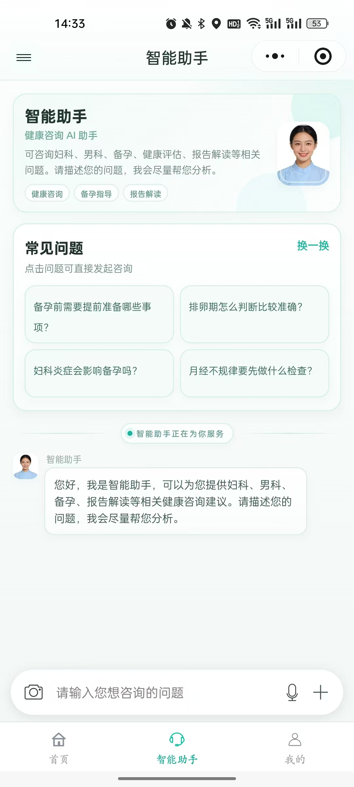 | 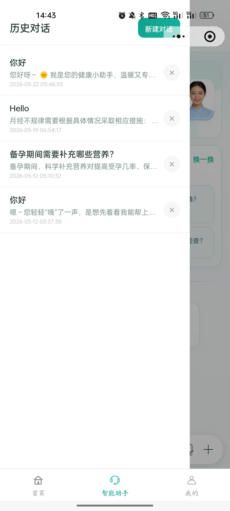 |

### 个人中心
| 👤 个人中心主页 | 📊 量表记录 | 👅 舌苔记录 |
|:---:|:---:|:---:|
| 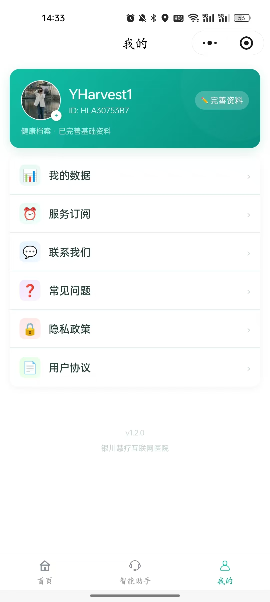 | 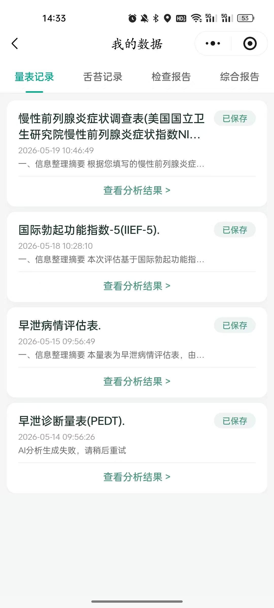 | 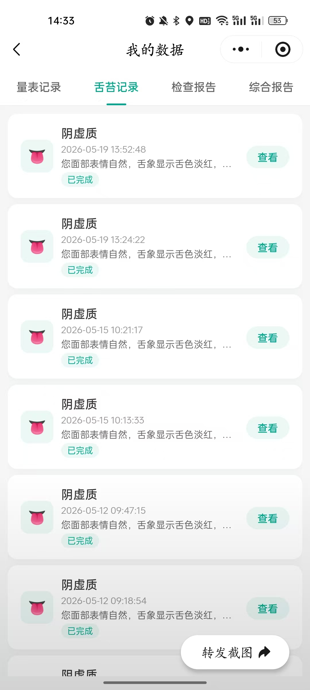 |

| 📁 检查报告 | � 综合报告 | ✏️ 完善资料 |
|:---:|:---:|:---:|
| 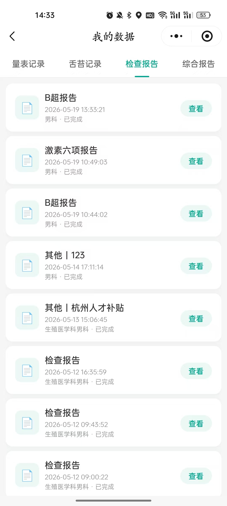 | 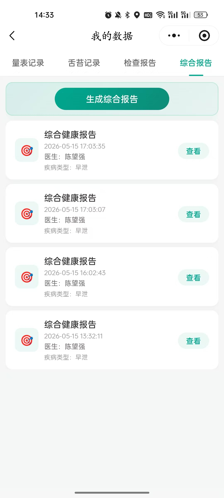 | 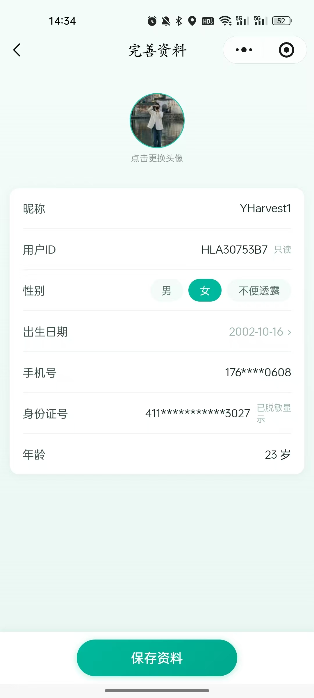 |

| 🔔 消息订阅 | ❓ 常见问题 | 📞 联系我们 |
|:---:|:---:|:---:|
| 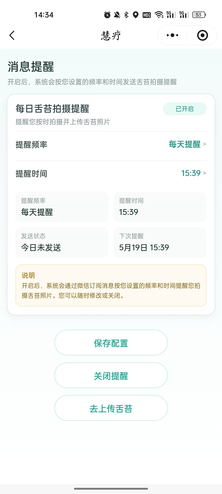 | 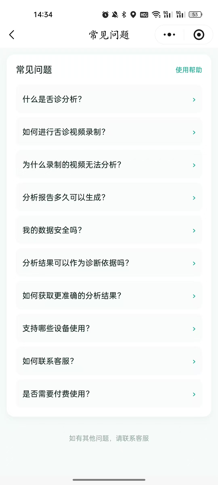 | 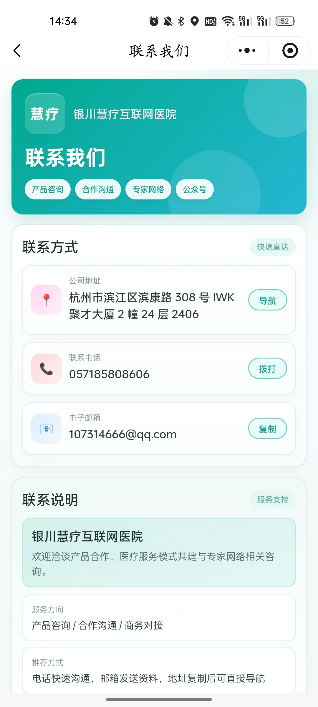 |

## 后端服务架构

### 服务端口
- **主服务**: `http://127.0.0.1:8020` (chat_proxy_server.py)
- **数据库**: MySQL 3306 (miniprogramYQY)

### API 接口统计
- **总计**: 44 个接口
  - GET 接口: 21 个
  - POST 接口: 23 个

### 主要接口分类
| 分类 | 接口数量 | 说明 |
|------|---------|------|
| 用户相关 | 6 | 登录、资料、头像等 |
| 量表相关 | 8 | 开始、提交、记录、报告等 |
| 舌诊相关 | 2 | 列表、详情 |
| AI对话 | 4 | 对话、会话管理等 |
| 报告相关 | 5 | 创建、上传、完成、删除 |
| 综合报告 | 4 | 生成、预览、详情等 |
| 订阅消息 | 5 | 配置、开关、发送等 |
| 其他 | 10 | 医生列表、预约提醒等 |

### 外部服务集成
| 服务 | 用途 | API提供商 |
|------|------|----------|
| FastGPT | AI智能对话 | 自建/第三方 |
| SiliconFlow | 量表AI分析 | siliconflow.cn |
| 微信开放平台 | 用户登录、订阅消息 | weixin.qq.com |

## 数据库设计

### 核心数据表 (16张)
| 表名 | 用途 | 关键字段 |
|------|------|---------|
| crm_user_baseinfo | 用户基础信息 | id(openid), nickname, phone |
| crm_questionnaire_template | 量表模板 | id, template_name, total_questions |
| crm_questionnaire_user_record | 用户量表记录 | id, user_id, status, score |
| crm_questionnaire_user_subject_record | 用户作答明细 | record_id, subject_id, score |
| ai_chat_replies | AI回复存档 | session_id, question, reply, model |
| chat_messages | 对话消息记录 | session_id, role, content |
| subscription_send_records | 订阅消息记录 | user_id, template_id, status |


## 快速开始

### 环境要求

**前端环境:**
- 微信开发者工具 (最新稳定版)
- Node.js 16+
- npm 或 yarn

**后端环境:**
- Python 3.8+
- MySQL 5.7+ 或 8.0+
- pip (Python包管理器)

### 后端依赖安装

```bash
cd huiliaoMiniPY

# 安装Python依赖
pip install pymysql requests

# 或使用requirements.txt（如果存在）
pip install -r requirements.txt
```

### 数据库初始化

```sql
-- 创建数据库
CREATE DATABASE miniprogramYQY CHARACTER SET utf8mb4 COLLATE utf8mb4_unicode_ci;

-- 创建用户（建议使用专用账号）
CREATE USER 'huiliao'@'localhost' IDENTIFIED BY '你的密码';
GRANT ALL PRIVILEGES ON miniprogramYQY.* TO 'huiliao'@'localhost';
FLUSH PRIVILEGES;
```

### 启动后端服务

```bash
cd huiliaoMiniPY

# 方式1: 直接运行（开发模式）
python chat_proxy_server.py

# 方式2: 后台运行
nohup python chat_proxy_server.py > logs/app.log 2>&1 &

# 方式3: Systemd服务（生产环境推荐）
sudo systemctl start huiliao
```

服务启动成功后会输出:
```
慧疗后端服务启动成功
```

### 启动小程序前端

1. 打开微信开发者工具
2. 导入项目目录: `huiliaoMiniProgram`
3. 在「详情」→「本地设置」中勾选「不校验合法域名、web-view（业务域名）、TLS版本以及HTTPS证书」
4. 点击「编译」按钮预览

### 配置说明

#### 后端配置 (config.json)

```json
{
  "server": {
    "host": "127.0.0.1",
    "port": 8020,
    "debug": false
  },
  
  "database": {
    "mysql": {
      "host": "localhost",
      "port": 3306,
      "user": "huiliao",
      "password": "⚠️ 请修改为真实密码",
      "database": "miniprogram",
      "charset": "utf8mb4"
    }
  },

  "wechat": {
    "appid": "⚠️ 你的小程序AppID",
    "secret": "⚠️ 你的小程序AppSecret"
  },

  "fastgpt": {
    "base_url": "https://api.fastgpt.in/api/v1",
    "api_key": "⚠️ 你的FastGPT API Key",
    "model": "default",
    "timeout": 30
  },

  "siliconflow": {
    "base_url": "https://api.siliconflow.cn/v1",
    "api_key": "⚠️ 你的SiliconFlow API Key",
    "model": "deepseek-ai/DeepSeek-V4-Flash",
    "timeout": 60
  }
}
```


#### 前端API地址配置

**文件位置**: `huiliaoMiniProgram/miniprogram/app.ts`

```typescript
// 全局API基础地址（约第20行）
const BASE_URL = 'https://miniprogram.huiliaoyiyuan.com'

// 开发环境可改为:
// const BASE_URL = 'http://127.0.0.1:8020'
```


## 技术栈

### 前端技术
| 技术 | 版本 | 用途 |
|------|------|------|
| 微信小程序框架 | 最新版 | 基础框架 |
| TypeScript | 4.x | 类型安全的JavaScript |
| WXML/WXSS | - | 微信标记语言/样式 |
| wx.request API | - | 网络请求 |

### 后端技术
| 技术 | 版本 | 用途 |
|------|------|------|
| Python | 3.8+ | 主开发语言 |
| PyMySQL | 1.0+ | MySQL数据库驱动 |
| requests | 2.28+ | HTTP客户端库 |
| ThreadingHTTPServer | 内置 | HTTP服务器(无框架) |

### 基础设施
| 组件 | 说明 |
|------|------|
| MySQL 5.7+/8.0+ | 关系型数据库 |
| Nginx (可选) | 反向代理、SSL终止、静态资源缓存 |
| Systemd/Supervisor | 进程管理（生产环境）|

## 性能指标

| 功能模块 | 平均响应时间 | 说明 |
|---------|------------|------|
| 用户登录 | 500ms - 2s | 含微信API调用 |
| 量表提交 | **5-12s** ⚠️ | 含SiliconFlow AI分析（性能瓶颈）|
| AI对话 | 2-5s | FastGPT响应时间 |
| 文件上传 | 1-3s | 取决于文件大小和网络 |
| 综合报告生成 | 30-90s | 建议异步化处理 |

## 开发规范

### 代码风格
- 前端遵循 TypeScript 严格模式
- 后端遵循 PEP 8 Python编码规范
- 注释使用中文（面向中文团队）

### Git 提交规范
```
feat: 新功能
fix: 修复bug
docs: 文档更新
style: 格式调整
refactor: 重构
perf: 性能优化
test: 测试相关
chore: 构建/工具链
```

### 分支管理
- `main`: 生产环境代码
- `develop`: 开发主分支
- `feature/*`: 新功能分支
- `hotfix/*`: 紧急修复分支

## 注意事项

### 安全要求
- ⚠️ 微信 AppSecret 等敏感信息需妥善保管
- ✅ 建议使用环境变量或密钥管理系统存储敏感配置
- ✅ 生产环境必须启用 HTTPS

### 文件上传限制
- 单文件最大: 10MB
- 支持格式: jpg, jpeg, png, pdf
- 单个报告最多: 9个附件

### 视频要求（舌诊功能）
- 大小不超过 5MB
- 时长 10-20 秒
- 帧率大于 2fps
- 画面中需要包含人脸和舌头

### 权限需求
- 相机权限（拍摄舌苔）
- 相册权限（选择已有照片）
- 网络权限（API调用）

## 常见问题

**Q: 量表提交很慢怎么办？**
> A: 这是正常现象。当前实现会同步调用SiliconFlow AI进行分析，耗时5-12秒。长期方案是改为异步任务队列。临时可将前端超时时间调整为120秒。

**Q: 如何切换开发/生产环境？**
> A: 修改 `app.ts` 中的 `BASE_URL` 和 `config.json` 中的数据库/API配置即可。

**Q: 数据库连接失败？**
> A: 检查MySQL服务是否启动，确认config.json中的连接参数正确，验证用户权限。


## 联系方式

- **项目名称**: 慧疗微信小程序
- **公司名称**: 生命涌现（杭州）科技有限公司
- **技术支持**: 易秋月 17629950608

## 许可证

© 2026 慧疗项目组. All rights reserved.

---

## 更新日志

### v1.5.1
- ✨ 新增积分商城功能
- ✨ 新增综合报告生成功能
- ✨ 新增订阅消息推送系统
- 🔧 重构后端架构，统一为单服务
- 📝 完善数据库设计和API接口
- 🐛 修复多个已知问题
- 📸 更新所有页面截图

### v1.0 (初始版本)
- 基础功能：舌诊上传、AI对话、量表填写
- 后端双服务架构
